# CodeCompass

A local code knowledge graph that gives AI agents (and humans) a map of your codebase — so they know what's connected before they edit.

---

## The problem

AI coding agents read files one at a time. They don't know that renaming a function in `auth.py` will break three importers, a test file, and a CSS class that shares the name. They guess which files to open, miss dependencies, and introduce bugs.

## The solution

CodeCompass parses your codebase into a dependency graph — functions, classes, modules, imports, CSS selectors, HTML references — and stores it as a local JSON file. Agents query the graph before editing to see exactly what's connected.

No database. No cloud. One JSON file per repo.

---

## In practice

**Scenario 1 — Safe rename.** An agent is asked to rename `authenticate`. Instead of
grepping and hoping, it runs `codecompass query --blast-radius src/auth/login.py`
and instantly sees the three importers, the test file, and a SCSS selector that
share the name — then edits all of them in one pass, no broken build.

**Scenario 2 — Onboarding onto an unfamiliar pipeline.** A new contributor (human or
agent) needs to understand how `ingest_code` works. Running
`codecompass query --flow ingest_code` traces the full forward call graph — which
parser runs, where the graph gets written, what normalizes the triples — in one
command, instead of opening a dozen files to follow the thread:



The `json` flow format hands each node its real signature, docstring, and source
snippet, plus the numbered call order. An agent reads that and narrates the
flow in plain language — for example, the diagram above becomes:

> **How `ingest_code` works** (narrated by an agent from `--flow ... --format json`)
>
> 1. **`init_project`** — sets up the `.codecompass/` directory and registers the
>    project's `AGENTS.md` rules before anything is parsed.
> 2. **`get_client`** — opens the local NetworkX graph that everything will be
>    written into.
> 3. **`build_hierarchy`** — walks the repo and writes the Project → Folder → File
>    skeleton nodes.
> 4. **`parse_directory`** — recursively parses every supported file, extracting
>    functions, classes, imports, and call relationships.
> 5. **`normalize_triples`** — (optional) runs the Haiku pass to canonicalize
>    entity names.
> 6. **`write_code_triples_batch`** — persists all extracted relationships into the
>    graph, then reports the node count and refreshes `AGENTS.md`.
>
> Net effect: a repo goes from raw files to a queryable dependency graph in one
> pass, with the graph saved locally as JSON.

---

## What you get

Every node in the graph carries:
- **`kind`** — type and language combined (e.g. `function:python`, `class:typescript`, `css_selector:scss`)
- **`description`** — human-readable label (e.g. `python function in src/auth/login.py`)
- **Typed edges** — `CALLS`, `IMPORTS`, `INHERITS`, `DEFINED_IN`, `STYLES`, `USES_VAR`, `REFERENCES`, etc.

Agents can answer structural questions in milliseconds without reading a single file:

```bash
# What breaks if I edit this?
codecompass query --blast-radius src/auth/login.py

# Who calls this function?
codecompass query --impact "authenticate"

# What does this file depend on?
codecompass query --deps src/api/routes.py

# Full project structure with entity types
codecompass query --tree
```

All commands default to the current directory.

---

## Setup

### Prerequisites

- Python 3.10+
- pip

### Install

```bash
pip install codecompass-mcp
```

This gives you:
- the `codecompass` CLI
- the `codecompass-mcp` MCP server binary

### Connect to an MCP client

The server speaks stdio MCP. It defaults to the process's current working directory, so if the client starts it inside a project it just works. To query a different project, the agent calls `set_repo`.

**Claude Desktop** — add to `~/Library/Application Support/Claude/claude_desktop_config.json` (macOS) or `%APPDATA%\Claude\claude_desktop_config.json` (Windows):

```json
{
  "mcpServers": {
    "codecompass": {
      "command": "codecompass-mcp"
    }
  }
}
```

**Cline / Cursor / other clients** — add a server with command `codecompass-mcp`.

Then ask the agent to run:

```
Use the codecompass MCP server. If you need to switch projects, set_repo to /path/to/project, then query ...
```

If you prefer a fixed default repo, set `CODECOMPASS_REPO=/path/to/project` in the MCP server environment. The server auto-initializes `.codecompass/` if missing. Call the `ingest()` tool from the agent to keep the graph up to date, or run `codecompass ingest-code` inside the project first.

### Index a project

```bash
cd /path/to/your/project
codecompass init
codecompass ingest-code
```

That's it. Two commands:
1. **`init`** creates `.codecompass/` and writes agent instructions into `AGENTS.md`
2. **`ingest-code`** parses all source files and builds the graph

`ingest-code` runs `init` automatically if `.codecompass/` doesn't exist yet.

### What happens on init

- Creates `.codecompass/` with `graph.json`, `overview.md`, `memory.md`, and `learnings.md`
- Writes a `## Code graph` section into the project's `AGENTS.md` with mandatory rules for agents:
  - Run `--blast-radius` before editing any file
  - Run `--impact` before calling unfamiliar symbols
  - Re-ingest after creating or deleting files

Any AI agent that reads `AGENTS.md` (Claude Code, OpenCode, Cursor, etc.) will follow these rules automatically.

---

## Hard enforcement for Claude Code & Pi (optional)

`AGENTS.md` is an instruction — a well-behaved agent follows it, but nothing
stops it from reaching for `grep`/`cat` out of habit. If you want that
actually blocked instead of just discouraged, both Claude Code and
[pi](https://pi.dev) support hard tool-call enforcement via hooks/extensions.

The block only covers what codecompass unambiguously replaces — searching or
reading code content (`grep`, `rg`, `cat`, the `Grep` tool). `ls`/`find` are
left alone; they have legitimate non-code uses (checking build output,
confirming a generated file exists, listing fixtures) that the graph doesn't
cover. Guide that judgment call with a decision-rule note in your agent
instructions rather than blocking it — see the `AGENTS.md` this tool
generates for the exact wording.

### Claude Code

Add a `PreToolUse` hook in `.claude/settings.json`:

```json
{
  "hooks": {
    "PreToolUse": [
      { "matcher": "Bash", "hooks": [{ "type": "command", "command": "python3 .claude/hooks/block-file-search.py" }] },
      { "matcher": "Grep", "hooks": [{ "type": "command", "command": "python3 .claude/hooks/block-file-search.py" }] }
    ]
  }
}
```

`.claude/hooks/block-file-search.py` reads the tool call from stdin, blocks
`Grep` and `cat`/`grep`/`rg` inside `Bash` (exit code `2`, with the reason
printed to stderr so Claude sees it and redirects to codecompass), and
allows everything else.

### Pi

Two files:

- `.pi/APPEND_SYSTEM.md` — appended to the system prompt every session,
  stating the codecompass-first rule plus the graph-vs-`ls` decision rule.
- `.pi/extensions/codecompass-guard.ts` — a `tool_call` handler that blocks
  the `grep` tool and `cat`/`grep`/`rg` inside `bash`.

### Activating

Neither of these hot-reload into an already-running session:

- **Claude Code** — start a new session in the repo; accept the trust prompt
  (hooks execute shell commands, so Claude Code asks first).
- **Pi** — project-local `.pi/` resources only load after the project is
  trusted. Accept the trust prompt on startup, or run `/trust` and restart
  `pi` once.

After that one-time trust, both pick the files up automatically on every
future session in the repo — nothing to re-inject manually.

---

## Queries

| Command | When to use it |
|---|---|
| `codecompass query --blast-radius <file_or_symbol>` | Before editing — see everything that depends on it |
| `codecompass query --impact <symbol>` | Before renaming/removing — find all callers and importers |
| `codecompass query --deps <file>` | Understanding a file — see what it imports and uses |
| `codecompass query --trace <function>` | Follow a call chain forward |
| `codecompass query --tree` | Orient yourself — full project structure |
| `codecompass query --styles <element>` | Find CSS selectors for an HTML element |
| `codecompass query --batch-impact <f1> <f2> ...` | Multi-file PR — union blast radius |
| `codecompass query --flow <entry_symbol>` | Trace the call/import flow from an entry point |
| `codecompass query --dead-code` | Find functions/classes with no caller or importer |

Add `--rich` for formatted table output. Add `--hops N` to control traversal depth (default: 3).

### Dead code

`--dead-code` reports entities with no inbound `CALLS`/`IMPORTS`/`REFERENCES` edge — candidates for removal such as old helpers, superseded function versions, or orphaned scripts:

```bash
codecompass query --dead-code                      # likely-dead only
codecompass query --dead-code --include-entrypoints  # also show probable entry points
```

Results are split into **likely dead** (private/internal, no caller) and **possible entry points** (`run_*`, handlers, tests — invoked by a runtime, not a static call). This is **static analysis**: dynamic dispatch, reflection, and string-based invocation are invisible, so every result is a candidate to verify (grep the name across the repo) before deleting.

### Flow charts

`--flow` traces forward from an entry point along `CALLS` and `IMPORTS` edges. Pick an output format with `--format`:

```bash
codecompass query --flow "src.main" --hops 3                    # draw.io (default)
codecompass query --flow "src.main" --format mermaid           # Markdown + mermaid
codecompass query --flow "src.main" --format json              # agent narration
```

Every format numbers each call by source line so call order is explicit. By default, external/stdlib symbols are filtered out — add `--include-external` to show everything. Output is written to `.codecompass/flow_<entry>.{drawio,md,json}`.

- **`drawio`** — opens in [draw.io](https://app.diagrams.net) (desktop or web). Nodes color-coded by type, entry point has a thick border, edges color-coded by relationship (blue = CALLS, green = IMPORTS).
- **`mermaid`** — a Markdown file with an embedded mermaid flowchart that renders directly on GitHub. Convert to SVG with `npx @mermaid-js/mermaid-cli -i flow_<entry>.md -o flow_<entry>.svg`.
- **`json`** — each node carries its real signature, docstring, source snippet, and line range; each edge carries its call order and call site. Built for agents: feed it to an LLM to generate a comprehensive data-flow explanation of how a pipeline or feature actually works.

---

## Commands

| Command | Purpose |
|---|---|
| `codecompass init [path]` | Create `.codecompass/` and register in `AGENTS.md` |
| `codecompass ingest-code [path]` | Parse source files and build/rebuild the graph |
| `codecompass query <flags> [path]` | Query the graph (blast-radius, impact, deps, flow, tree, etc.) |
| `codecompass watch [path]` | Live re-index on file changes |
| `codecompass load-triples <file> <path>` | Load pre-processed triples from JSON |
| `codecompass setup` | Copy instructions to `~/.config/opencode/codecompass/` |

All commands default to `.` (current directory) when path is omitted.

---

## MCP server

CodeCompass also runs as an MCP server so compatible clients can call graph queries as tools instead of parsing CLI output.

### Run the server

```bash
# Serve the current directory's graph over stdio (default MCP transport)
codecompass-mcp

# Serve a specific repo
CODECOMPASS_REPO=/path/to/repo codecompass-mcp

# Or use the CLI subcommand
codecompass mcp /path/to/repo
```

### Available tools

| Tool | What it returns |
|---|---|
| `set_repo(repo_path)` | Select the project to query (defaults to cwd) |
| `get_repo()` | The currently selected project |
| `init()` | Create `.codecompass/` and write `AGENTS.md` |
| `ingest()` | Re-index the repo |
| `blast_radius(target, hops=3)` | Files reachable from a file or symbol |
| `batch_impact(targets, hops=3)` | Union of blast radii for multiple targets |
| `impact(symbol, hops=3)` | Callers and importers of a symbol |
| `deps(file_path, hops=3)` | What a file imports or depends on |
| `trace(symbol, hops=3)` | Forward call chain from a symbol |
| `styles(element)` | CSS selectors that style an element |
| `flow(entry_symbol, hops=3, format="json", include_external=False)` | Call/import flow trace (json, mermaid, or drawio) |
| `dead_code(include_entrypoints=False)` | Entities with no inbound caller |
| `tree()` | Full project hierarchy |

Configure your MCP client (Claude Desktop, Cline, etc.) to run `codecompass-mcp` in the repo you want to query.

---

## Supported languages

| Language | Entity types extracted |
|---|---|
| Python | modules, functions, classes, imports, calls, inheritance |
| JavaScript | modules, functions, classes, imports, calls |
| TypeScript / TSX | modules, functions, classes, imports, calls |
| HTML | elements, references, includes |
| CSS | selectors, variables, definitions |
| SCSS | selectors, variables, mixins, imports |
| `.styles.ts` (Lit) | CSS-in-JS — `var(--token)` usages, `:host` declarations |

---

## How it works

```
Source files
    │
    ▼
hierarchy_builder    — walks repo → Project / Folder / File skeleton
    │
    ▼
code_parser          — tree-sitter extraction (no API calls)
    │                  extracts entities + relationships as CodeTriples
    ▼
graph.json           — NetworkX MultiDiGraph serialized as JSON node-link data
    │                  typed edges: CALLS, IMPORTS, INHERITS, STYLES, DEFINED_IN, …
    │                  node attrs: kind, description, language, entity_type, file
    ▼
code_query_cli       — graph traversal: blast-radius, impact, deps, trace, tree
    │
    ▼
AGENTS.md            — mandatory rules injected into the project for any AI agent
```

Everything runs locally, in-process. No network calls, no database, no API keys.

---

## Project structure

```
codecompass/
├── graph/
│   ├── cli.py                  pip entry point → main.py
│   ├── code_graph_client.py    NetworkX graph client — nodes, edges, traversal
│   ├── code_query_cli.py       query CLI — blast-radius / impact / deps / trace / tree / dead-code / flow
│   └── setup.py                opencode setup wizard
├── ingestion/
│   ├── code_parser.py          tree-sitter entity + relationship extraction
│   ├── hierarchy_builder.py    Project → Folder → File skeleton
│   ├── file_watcher.py         incremental re-index on file changes
│   └── code_normalizer.py      optional entity name normalization (Haiku)
├── models/
│   └── code_types.py           CodeTriple, FileNode, FolderNode
├── opencode/
│   └── instructions.md         agent instructions for opencode integration
├── config.py                   env var config with fallback defaults
└── main.py                     CLI dispatch: init / ingest-code / query / watch
```

Inside each indexed project:

```
your-project/
├── .codecompass/
│   ├── graph.json              the code knowledge graph (auto-generated)
│   ├── overview.md             what the repo is / how to run it (read first)
│   ├── memory.md               architecture & data flow (human-editable)
│   └── learnings.md            gotchas, decisions, dead code (human-editable)
└── AGENTS.md                   agent instructions (auto-updated by codecompass)
```

---

## Tips

- **Commit or gitignore** `.codecompass/graph.json` — your choice. Committing it means teammates and CI get the graph for free.
- **Re-ingest after refactors** — moved functions, renamed classes, deleted files. The graph doesn't auto-update unless `watch` is running.
- **Use `watch` during active development** — `codecompass watch` keeps the graph current as you save files.
- **Install once, use everywhere** — `pip install -e .` from the codecompass directory. The `codecompass` command works in any project.

---

## Limitations

- **Structure only** — the graph knows what calls what, not what anything *means*
- **No cross-repo edges** — entities outside the indexed repo won't appear
- **Lit CSS** covers explicit `var(--foo)` and `:host` declarations; generated property names from `theme.props()` are not indexed
- **Large repos** (50k+ files) may produce sizable graph files — benchmark before committing
