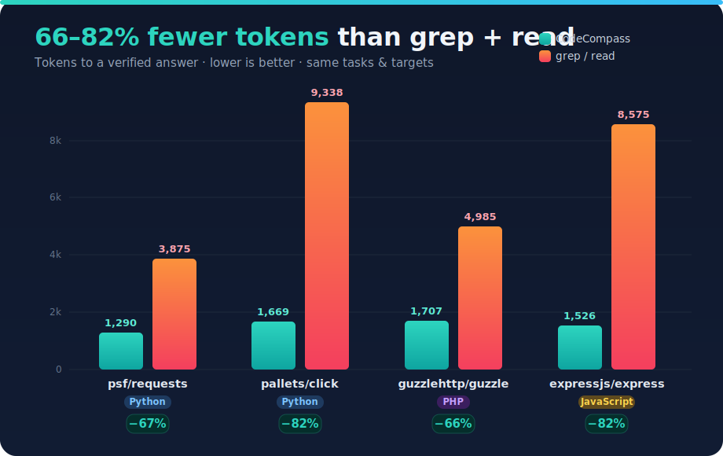

# CodeCompass

A local code knowledge graph that gives AI agents a map of your codebase — so they navigate by structure instead of grepping blind, and know what's connected before they edit.

No database. No cloud. One JSON file per repo. Python, JavaScript/TypeScript, PHP, HTML/CSS.

---

## Why it's faster

AI agents read files one at a time and grep to find their way. On a real task that means opening candidate after candidate to answer "who calls this?" or "what breaks if I change this?" CodeCompass answers those from a precomputed graph, so the agent reads *only the code it actually needs*.

We benchmarked it against traditional grep/read on six standard tasks (impact, blast radius, dead code, flow trace, find-and-edit, feature scoping) across four real repos, measuring **tokens to a verified answer** — the query output *plus* the code still read to trust it.



CodeCompass wins every relational and discovery task; grep only holds even on a
plain textual find of a known string. The advantage grows with codebase size and
name collisions. Full breakdown, per-task numbers, and honest limitations in
**[docs/benchmark-results.md](docs/benchmark-results.md)**.

---

## The workflow

The graph turns navigation into a cheap, deterministic loop:

**discover → trace → read → edit**

1. **Discover** — find the symbols you care about without opening files:

   | You have… | Use |
   |---|---|
   | a concept, name, or pattern | `grep` (regex over graph entities) |
   | the full layout | `tree` |

2. **Trace** — a relationship around a known symbol/file:

   | Question | Use |
   |---|---|
   | who calls / would break if I change this? | `impact` |
   | what files are affected if I edit this file? | `blast_radius` |
   | what does this file depend on? | `deps` |
   | what does this entry point call, step by step? | `flow` |
   | explain a flow to a human (diagram + narration) | `flow_summary` |
   | anything unused? | `dead_code` |

3. **Read** the specific slice the graph points to (`impact` gives `file:line`).
4. **Edit** — check `impact`/`blast_radius` first so you don't miss a caller.

---

## What makes it accurate

- **Precise call graph.** Nodes are file- *and* class-qualified, so
  `Command.invoke` and `Context.invoke` (same file) stay distinct, and
  `impact` returns the callers of a *specific* method — no same-named
  look-alikes, no test noise.
- **Receiver-type resolution.** `self.send()` resolves to the enclosing class;
  `x = new Adapter()` / `x: Adapter` / `x = make()` (with a return type) resolve
  by type. Calls that can't be typed statically (dynamic dispatch) are
  **surfaced flagged `resolved: false`** — never dropped, never claimed precise.
- **Line-anchored.** Every `impact` caller carries its real call-site
  `file:line`, so verification reads a few lines, not a whole function.

---

## Install

```bash
pip install codecompass-mcp
```

Gives you the `codecompass` CLI and the `codecompass-mcp` MCP server.

### Index a project

```bash
cd /path/to/your/project
codecompass init          # creates .codecompass/, writes AGENTS.md
codecompass ingest-code   # parses source and builds the graph
```

`ingest-code` runs `init` automatically if needed. Re-ingest after refactors (or run `codecompass watch` to keep the graph live).

### Connect an MCP client

The server speaks stdio MCP and defaults to the working directory.

**Claude Desktop** — `~/Library/Application Support/Claude/claude_desktop_config.json` (macOS) / `%APPDATA%\Claude\claude_desktop_config.json` (Windows):

```json
{ "mcpServers": { "codecompass": { "command": "codecompass-mcp" } } }
```

**Cline / Cursor / other** — add a server with command `codecompass-mcp`. To query a different repo, the agent calls `set_repo`, or set `CODECOMPASS_REPO=/path/to/project` in the server env.

---

## Queries (CLI)

```bash
# discover
codecompass query --grep "^get_"            # regex over graph entities

# trace
codecompass query --impact "Session.send"   # callers (disambiguated), with file:line
codecompass query --blast-radius src/app.py  # what depends on this file
codecompass query --deps src/api/routes.py   # what this file imports
codecompass query --flow "Session.request"   # lean call-flow structure
codecompass query --flow-summary "main"      # flow + mermaid + narration
codecompass query --dead-code                # unreferenced candidates
codecompass query --tree                     # full hierarchy
```

Add `--hops N` for traversal depth (start at 1 and follow the one path you need). Add `--rich` for tables.

### Enrichment (agent-in-the-loop)

```bash
codecompass enrich                 # stage entities for an agent swarm: one-line descriptions + missing call edges
codecompass enrich --apply         # merge the swarm's results into the graph
codecompass add-entity <name> --file src/a.py --line 9 --description "Async helper"
codecompass add-call caller callee --line 2
```

`enrich` is a bulk, user-triggered pass. `add-entity`/`add-call` are the
opportunistic version: as an agent reads code and spots something the parser
missed, it records it immediately. Everything agent-written is marked
`agent_inferred` and **preserved across re-ingests** — the graph gets better
with use. Ambiguous call targets are skipped, never guessed.

### Flow: `flow` vs `flow-summary`

- **`flow`** — lean structure only (node name/kind/file/depth, edge from/to/order/line). What an agent needs to navigate; no embedded source.
- **`flow-summary`** — the trace rendered for a human: a mermaid flowchart with prose narration (`--format mermaid`, default), or source-embedded JSON (`--format json`), or a draw.io diagram (`--format drawio`). Written to `.codecompass/flow_<entry>.*`.

---

## MCP tools

| Tool | Returns |
|---|---|
| `grep(pattern, field, ignore_case)` | Regex search over graph entities |
| `impact(symbol, hops)` | Callers/importers, disambiguated, with `resolved` + `line` |
| `blast_radius(target, hops)` | Files reachable from a file or symbol |
| `batch_impact(targets, hops)` | Union of blast radii for a multi-file change |
| `deps(file_path, hops)` | What a file imports |
| `flow(entry_symbol, hops)` | Lean call/import flow structure |
| `flow_summary(entry_symbol, hops, format)` | Flow + narration (mermaid/json/drawio) |
| `trace(symbol, hops)` | Forward call chain |
| `dead_code(include_entrypoints)` | Entities with no inbound caller |
| `styles(element)` | CSS selectors that style an element |
| `tree()` | Full project hierarchy |
| `enrich(apply, batch_size)` | Stage/merge agent-written descriptions + missing call edges |
| `add_entity(name, kind, file, line, description)` | Record a parser-missed entity (`agent_inferred`) |
| `add_call(caller, callee, line)` | Record a parser-missed CALLS edge (`agent_inferred`) |
| `set_repo` / `get_repo` / `init` / `ingest` | Project selection & indexing |

---

## Supported languages

| Language | Extracted |
|---|---|
| Python | functions, classes, imports, calls, inheritance, receiver/return-type inference, `__all__`/public exports |
| JavaScript / JSX | functions, classes, `require`/`import`, calls, receiver/return-type inference, `module.exports`/`export` |
| TypeScript / TSX | as JS, plus type annotations for receiver resolution |
| PHP | functions, classes, methods, calls, receiver/return-type inference, `public`/`private`/`protected` visibility |
| HTML | elements, references, includes |
| CSS / SCSS | selectors, variables, `@import`/`@use` |
| `.styles.ts` (Lit) | CSS-in-JS `var(--token)` usages and `:host` declarations |

Receiver capture, type inference, and export/visibility awareness apply to all
call-based languages (JS/TS, Python, PHP). Node de-merge and the discovery tools
are language-agnostic.

---

## Navigation guardrail (optional, installed by `init`)

`AGENTS.md` guides any agent through the discover→trace→read→edit loop. For
Claude Code and [pi](https://pi.dev), `init` also installs a `PreToolUse` hook
that **blocks code *search*** (`grep`/`rg`, the `Grep`/`Glob` tools) and
**whole-file `cat` — but only inside a codecompass-registered repo** (tracked in
`~/.codecompass/repos`, one line per `init`'d project). Reads outside any
registered repo pass through: no graph exists there, so nothing is blocked.
**Targeted reads stay free** (the `Read` tool, `sed -n`, `head`/`tail`). The
point is to change the default reflex to graph-first, not to remove reads.
Each project's Claude hook lives under its own `.claude/hooks/` with the
project root baked in — edit or delete it to adjust. Block messages point the
agent at the right repo's graph: `codecompass query \"<repo>\" --grep …`.

---

## How it works

```
Source files
   ▼  hierarchy_builder   walks repo → Project / Folder / File skeleton
   ▼  code_parser         tree-sitter extraction (no API calls) → typed CodeTriples
   ▼  graph.json          NetworkX MultiDiGraph as JSON; file+class-qualified nodes,
                          typed edges (CALLS/IMPORTS/INHERITS/STYLES/…), resolved calls
   ▼  code_query_cli      traversal: grep / impact / blast-radius /
                          deps / flow / dead-code / tree
   ▼  enricher            agent-in-the-loop: enrich batches (descriptions +
                          missing calls) and opportunistic add_entity/add_call
                          writes — agent_inferred, preserved across re-ingest
```

Everything runs locally, in-process. No network, no database, no API keys.

Inside each indexed project:

```
your-project/
├── .codecompass/graph.json   the code knowledge graph (auto-generated)
└── AGENTS.md                 discovery guide for agents (auto-updated)
```

---

## Limitations

- **Structure first, semantics optional** — the parser knows what calls what,
  not what it means. `enrich` closes that gap with agent-written descriptions
  and missed edges, marked `agent_inferred`.
- **Static analysis** — dynamic dispatch, reflection, and string-based invocation
  can't be fully resolved. `impact` surfaces those flagged `resolved: false`, and
  `dead_code` results are always candidates to verify.
- **No cross-repo edges** — entities outside the indexed repo don't appear.
- **Re-ingest after refactors** — the graph doesn't auto-update unless `watch` is running.
