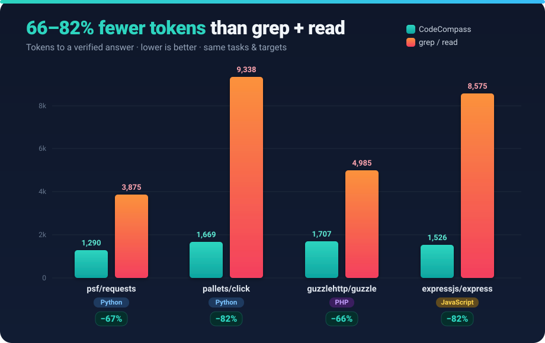

# CodeCompass

A local code knowledge graph that gives AI agents a map of your codebase — so they navigate by structure instead of grepping blind, and know what's connected before they edit. One graph query replaces dozens of file opens: fewer tokens, less compute, and every answer comes with a verifiable `file:line`. And it compounds — descriptions, edges, and corrections agents write back survive re-indexes and persist across sessions, so each task starts from everything every previous session learned instead of from zero.

No cloud. No API keys for core queries. One JSON graph per repo. Python, JavaScript/TypeScript, PHP, HTML/CSS.

---

## Why it's faster

AI agents read files one at a time and grep to find their way. On a real task that means opening candidate after candidate to answer "who calls this?" or "what breaks if I change this?" CodeCompass answers those from a precomputed graph, so the agent reads *only the code it actually needs*.

We benchmarked it against traditional grep/read on six standard tasks (impact, blast radius, dead code, flow trace, find-and-edit, feature scoping) across four real repos, measuring **tokens to a verified answer** — the query output *plus* the code still read to trust it.



CodeCompass wins every relational and discovery task; grep only holds even on a
plain textual find of a known string. The advantage grows with codebase size and
name collisions. Full breakdown, per-task numbers, and honest limitations in
**[docs/benchmark-results.md](docs/benchmark-results.md)**.

---

## The workflow

The graph turns navigation into a cheap, deterministic loop:

**discover → trace → read → edit**

1. **Discover** — find the symbols you care about without opening files:

   | You have… | Use |
   |---|---|
   | a concept, name, or pattern | `grep` (regex over graph entities) |
   | an idea, not a name ("where does caching go?") | `search` (semantic vector search) |
   | the full layout | `tree` |

2. **Trace** — a relationship around a known symbol/file:

   | Question | Use |
   |---|---|
   | who calls / would break if I change this? | `impact` |
   | what files are affected if I edit this file? | `blast_radius` |
   | what does this file depend on? | `deps` |
   | what does this entry point call, step by step? | `flow` |
   | explain a flow to a human (diagram + narration) | `flow_summary` |
   | anything unused? | `dead_code` |

3. **Read** the specific slice the graph points to (`impact` gives `file:line`).
4. **Edit** — check `impact`/`blast_radius` first so you don't miss a caller.

---

## What makes it accurate

- **Precise call graph.** Nodes are file- *and* class-qualified, so
  `Command.invoke` and `Context.invoke` (same file) stay distinct, and
  `impact` returns the callers of a *specific* method — no same-named
  look-alikes, no test noise.
- **Receiver-type resolution.** `self.send()` resolves to the enclosing class;
  `x = new Adapter()` / `x: Adapter` / `x = make()` (with a return type) resolve
  by type. Calls that can't be typed statically (dynamic dispatch) are
  **surfaced flagged `resolved: false`** — never dropped, never claimed precise.
- **Line-anchored.** Every `impact` caller carries its real call-site
  `file:line`, so verification reads a few lines, not a whole function.

---

## Install

```bash
curl -fsSL https://raw.githubusercontent.com/mmkumar5401/CodeCompass/main/install.sh | bash
```

or `uv tool install codecompass-mcp` (then `codecompass setup` to wire your
agent hosts). The installer bootstraps uv if missing — it brings its own
managed Python, so no system Python or project venv is ever touched, and every
agent host is pointed at the same venv-free binary (`~/.local/bin/codecompass-mcp`).
Gives you the `codecompass` CLI and the `codecompass-mcp` MCP server, and wires
every host it finds:

- **pi** — pi-mcp-adapter + pi-hooks extensions, skill, MCP server entry
- **opencode** — `opencode-hooks-plugin` plugin + MCP server entry in the global
  config, so the guard hooks (below) fire there too
- **Claude Code** — `claude mcp add codecompass -- codecompass-mcp`

### Index a project

Indexing is an MCP operation, not a CLI one. Start the server in your project
(`codecompass mcp` — it auto-runs `init` on first use) and the agent calls the
`ingest` tool to build the graph. Re-`ingest` after refactors, or run
`codecompass watch` to keep the graph live.

### Exclude paths — `.ccignore`

`.git`, `node_modules`, `dist`, `build`, `.venv`, and friends are skipped
already. For anything else — vendored dependencies, generated code, minified
bundles — drop a `.ccignore` at the repo root:

```
vendor/            # any directory named vendor, at any depth
api/generated/*    # anchored at the repo root
*.min.js
```

Gitignore-style globs, one per line, `#` starts a comment. A pattern without a
`/` matches any path component; one with a `/` is root-relative. No `!`
negation. Applies to `ingest` and `watch` alike.

Worth doing: a mid-size PHP repo whose `vendor/` is indexed spends ~72k of its
96k entities on Composer packages you will never ask about.

### Connect an MCP client

The server speaks stdio MCP and defaults to the working directory.

**Claude Desktop** — `~/Library/Application Support/Claude/claude_desktop_config.json` (macOS) / `%APPDATA%\Claude\claude_desktop_config.json` (Windows):

```json
{ "mcpServers": { "codecompass": { "command": "codecompass-mcp" } } }
```

**Cline / Cursor / other** — add a server with command `codecompass-mcp`. To query a different repo, the agent calls `set_repo`, or set `CODECOMPASS_REPO=/path/to/project` in the server env.

---

## Queries

Agents query the graph through the MCP tools (see the table below) — there is
no agent-facing query CLI. `grep`, `impact`, `blast_radius`, `deps`, `flow`,
`flow_summary`, `dead_code`, `tree` and friends are all MCP tools; pass
`hops` for traversal depth (start at 1 and follow the one path you need).

### Semantic search

`grep` finds symbols when you know the name; `search` finds them when you only
have the idea. It embeds every entity's name/kind/file/description with
fastembed's BGE-small model (ONNX, CPU-only, no API keys) into a local
turbovec index (`.codecompass/vectors.tvim` + a JSON payload sidecar) — a Rust
TurboQuant index, no server, no database. Opt in with:

```bash
pip install 'codecompass-mcp[search]'
```

The index follows the graph's lifecycle: wiped and rebuilt at the end of every
`ingest`, so parser nodes *and* agent-recorded ones are searchable. Without the
extra, ingest simply skips the vector step.

### Agent-written knowledge

The parser extracts structure. Everything it *can't* see — dynamic dispatch,
callbacks, runtime registration — and everything it can't know — what an entity
is FOR — comes from the agent reading the code and writing it back with
`add_entity` / `add_call`. There is no bulk enrichment pass and no LLM
backfill: the graph improves as it gets used, or not at all.

Descriptions are plain `description` attributes on the graph nodes. The
`ingest` rebuild carries node attributes from the old graph onto the new one
(fresh parser values win, and the parser never writes descriptions), so a
description survives exactly as long as its node does — a deleted or renamed
symbol takes its description with it. Agent-written nodes and edges are marked
`agent_inferred`; ambiguous call targets are skipped, never guessed.

### Flow: `flow` vs `flow-summary`

- **`flow`** — lean structure only (node name/kind/file/depth, edge from/to/order/line). What an agent needs to navigate; no embedded source.
- **`flow_summary`** — the trace rendered for a human: a mermaid flowchart with prose narration (`format="mermaid"`, default), or source-embedded JSON (`format="json"`), or a draw.io diagram (`format="drawio"`).

---

## MCP tools

| Tool | Returns |
|---|---|
| `grep(pattern, field, ignore_case)` | Regex search over graph entities |
| `search(query, limit)` | Semantic vector search over entity names/kinds/files/descriptions |
| `impact(symbol, hops)` | Callers/importers, disambiguated, with `resolved` + `line` |
| `blast_radius(target, hops)` | Files reachable from a file or symbol |
| `batch_impact(targets, hops)` | Union of blast radii for a multi-file change |
| `deps(file_path, hops)` | What a file imports |
| `flow(entry_symbol, hops)` | Lean call/import flow structure |
| `flow_summary(entry_symbol, hops, format)` | Flow + narration (mermaid/json/drawio) |
| `trace(symbol, hops)` | Forward call chain |
| `dead_code(include_entrypoints)` | Entities with no inbound caller |
| `styles(element)` | CSS selectors that style an element |
| `tree()` | Full project hierarchy |
| `add_entity(name, kind, file, line, description)` | Record a parser-missed entity, or describe an existing one (`agent_inferred`) |
| `add_call(caller, callee, line, relation)` | Record a parser-missed CALLS/IMPORTS/INHERITS edge (`agent_inferred`) |
| `set_repo` / `get_repo` / `init` / `ingest` | Project selection & indexing |

---

## Supported languages

| Language | Extracted |
|---|---|
| Python | functions, classes, imports, calls, inheritance, receiver/return-type inference, `__all__`/public exports |
| JavaScript / JSX | functions, classes, `require`/`import`, calls, receiver/return-type inference, `module.exports`/`export` |
| TypeScript / TSX | as JS, plus type annotations for receiver resolution |
| PHP | functions, classes, methods, calls, receiver/return-type inference, `public`/`private`/`protected` visibility |
| HTML | elements, references, includes |
| CSS / SCSS | selectors, variables, `@import`/`@use` |
| `.styles.ts` (Lit) | CSS-in-JS `var(--token)` usages and `:host` declarations |

Receiver capture, type inference, and export/visibility awareness apply to all
call-based languages (JS/TS, Python, PHP). Node de-merge and the discovery tools
are language-agnostic.

---

## Navigation guardrail (optional, installed by `init`)

`AGENTS.md` guides any agent through the discover→trace→read→edit loop. For
Claude Code, [pi](https://pi.dev), and opencode, `init` also installs a
`PreToolUse` hook that **blocks code *search*** (`grep`/`rg`, the `Grep`/`Glob`
tools) and **whole-file `cat` — but only inside a codecompass-registered repo**
(tracked in `~/.codecompass/repos`, one line per `init`'d project). Reads
outside any registered repo pass through: no graph exists there, so nothing is
blocked. **Targeted reads stay free** (the `Read` tool, `sed -n`, `head`/`tail`).
The point is to change the default reflex to graph-first, not to remove reads.
One guard script serves all three hosts: it lives at `.agents/hooks/
block-file-search.py` in each project (Claude reads it via `.claude/settings.json`,
pi via pi-hooks + `.pi/settings.json`, opencode via the opencode-hooks-plugin
plugin reading the same `.claude/settings.json`) — edit or delete it to adjust.
Block messages point the agent at the codecompass MCP tools (`grep`, `flow`,
`impact`, `deps`, …).

---

## How it works

```
Source files
   ▼  hierarchy_builder   walks repo → Project / Folder / File skeleton
   ▼  code_parser         tree-sitter extraction (no API calls) → typed CodeTriples
   ▼  graph.json          NetworkX MultiDiGraph as JSON; file+class-qualified nodes,
                          typed edges (CALLS/IMPORTS/INHERITS/STYLES/…), resolved calls
   ▼  code_queries       traversal helpers: grep / impact / blast_radius /
                          deps / flow / dead_code / tree
   ▼  mcp_server         FastMCP server — the only query surface for agents
   ▼  agent_writes        add_entity / add_call: what the parser can't see,
                          written back by the agent — agent_inferred, preserved
                          across re-ingest
```

Everything runs locally, in-process — no network, no database, no API keys.

Inside each indexed project:

```
your-project/
├── .codecompass/graph.json           the code knowledge graph, descriptions included (auto-generated)
├── .codecompass/vectors.tvim         semantic search index (optional, rebuilt on ingest)
├── .codecompass/vectors.meta.json    vector index payloads (optional, rebuilt on ingest)
├── .codecompass/overview.md          what this repo is (agent-maintained)
├── .codecompass/memory.md            how it's built (agent-maintained)
├── .codecompass/learnings.md         what to watch out for (agent-maintained)
└── AGENTS.md                         discovery guide for agents (auto-updated)
```

---

## Limitations

- **Structure first, semantics layered on** — the parser knows what calls what,
  not what it means. Agents close that gap as they work (`add_entity` /
  `add_call`, marked `agent_inferred`). An unexplored corner of the repo
  stays undescribed.
- **Static analysis** — dynamic dispatch, reflection, and string-based invocation
  can't be fully resolved. `impact` surfaces those flagged `resolved: false`, and
  `dead_code` results are always candidates to verify.
- **No cross-repo edges** — entities outside the indexed repo don't appear.
- **Re-ingest after refactors** — the graph doesn't auto-update unless `watch` is running.
